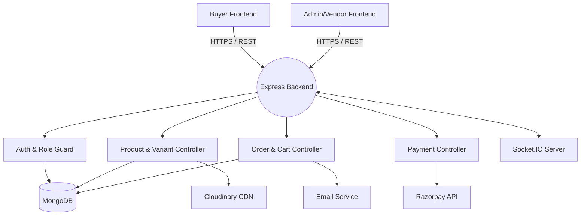
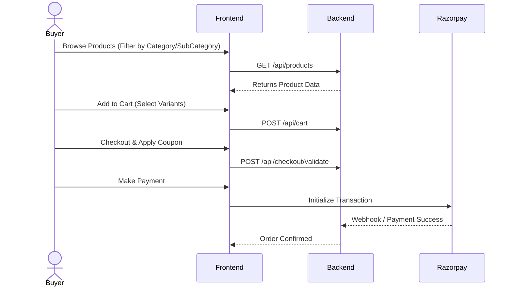
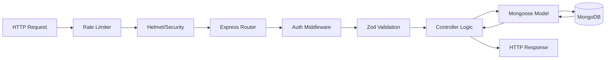

# E-Commerce Platform Technical Documentation

## 1. Project Overview
This project is a comprehensive, thrift-based e-commerce platform that supports three primary user roles: Buyers (Users), Vendors, and Administrators. It features a scalable Node.js/Express backend and two distinct frontend applications built with React and Vite: one for Buyers and one for Admins/Vendors. 

## 2. Purpose of the Project
To provide a reliable, scalable, and customizable digital marketplace where vendors can manage their digital or physical store presence, list products with variants, and handle orders, while users can seamlessly browse products, manage their cart/wishlist, and checkout using integrated payment solutions.

## 3. Problem it Solves
- **Fragmented Vendor Management:** Provides a centralized dashboard for multiple vendors to track inventory, variants, coupons, and orders without relying on third-party disconnected systems.
- **Scalability Issues:** Built with microservice-ready patterns, caching, and a NoSQL database to support high traffic and product variations.
- **Complex Checkout Flows:** Integrates cart, coupon validation, multiple addresses, and payment gateways seamlessly.

## 4. Features
- **Multi-Role Access Control:** Admin, Vendor, and User roles with isolated dashboards and permissions.
- **Product & Variant Management:** Deep variant configurations (size, color, material) with separate inventory tracking.
- **Order Processing & Invoicing:** Automated order state transitions and invoice generation.
- **Payment Gateway Integration:** Razorpay integration for secure transactions.
- **Coupon & Discount Engine:** Advanced rule-based discount validations (vendor-specific, category-specific, global).
- **Real-time Capabilities:** WebSockets (Socket.IO) for instant notifications.
- **Image Optimization:** Cloudinary integration for scalable media storage.

## 5. Technology Stack
- **Backend:** Node.js, Express.js
- **Database:** MongoDB (Mongoose ODM)
- **Frontend (Admin/Vendor):** React.js (Vite), Tailwind CSS, React Router, Socket.IO Client, Axios
- **Frontend (User):** React.js (Vite), Tailwind CSS, React Query (@tanstack/react-query), Framer Motion
- **Authentication:** JWT (JSON Web Tokens), bcryptjs
- **Payment & Services:** Razorpay (Payments), Cloudinary (Media), Nodemailer (Emails)
- **API Documentation:** Swagger UI

## 6. Folder Structure

```text
/t:/Category
├── backend/                  # Core API & Business Logic
│   ├── config/               # DB connection and third-party setups
│   ├── controllers/          # Request handlers separated by role/entity
│   ├── middleware/           # Auth, Error, Rate Limiting, Validation
│   ├── models/               # Mongoose DB Schemas (User, Product, Order, etc.)
│   ├── routes/               # API endpoint definitions
│   ├── services/             # Reusable business logic (e.g., mailer, payment)
│   └── utils/                # Helper functions (hashing, response formatting)
├── frontend/                 # Admin & Vendor Portal
│   ├── src/
│   │   ├── components/       # Reusable UI elements (Buttons, Modals, Tables)
│   │   ├── pages/            # View components (Dashboard, ProductList)
│   │   └── utils/            # API client configurations
├── User frontend/            # End-User / Buyer E-commerce Interface
│   ├── src/
│   │   ├── components/       # Product Cards, Cart Drawer, Checkout Form
│   │   ├── hooks/            # Custom React Query hooks for data fetching
│   │   └── pages/            # Home, Product Details, User Profile
└── Ecom_guide.md             # High-level domain documentation
```

## 7. Complete Architecture Diagram



## 8. User Flow (Buyer)



## 9. Application Flow
1. **Bootstrapping:** The Vite React applications load on the browser, fetching necessary configurations and hydrating state.
2. **Authentication Check:** The apps verify the presence of a valid JWT in local storage or cookies.
3. **Data Hydration:** React Query (User App) or `useEffect` hooks (Admin App) fetch initial data (e.g., dashboard stats, featured products).
4. **User Interaction:** Routing changes load different chunked components.
5. **API Syncing:** All mutations (POST/PUT/DELETE) trigger backend validation, DB updates, and subsequent frontend state invalidations.

## 10. Frontend Workflow
- **User App:** Heavily relies on `@tanstack/react-query` for caching, background fetching, and optimistic updates. UI is animated using `framer-motion`.
- **Admin App:** Utilizes standard React context or state combined with Axios interceptors. Emphasizes data tables, forms, and administrative controls.

## 11. Backend Workflow
- **Entry Point:** `server.js` configures middlewares (Helmet, CORS, Rate Limit) and mounts routers.
- **Routing:** Requests are delegated to specific route files (`routes/userRoutes.js`, `routes/productRoutes.js`).
- **Middleware Chain:** Validates payloads (using Zod) and authenticates users (JWT verification).
- **Controllers:** Handle the core request logic.
- **Models:** Interact directly with MongoDB.

## 12. API Flow



## 13. Database Schema (Key Entities)
- **User / Vendor:** `_id`, `name`, `email`, `password`, `role`, `status`.
- **Product:** `_id`, `vendorId`, `name`, `description`, `category`, `basePrice`.
- **Variant:** `_id`, `productId`, `attributes` (size, color), `stock`, `price_modifier`, `sku`.
- **Order:** `_id`, `userId`, `items` (array of variants/products), `totalAmount`, `paymentStatus`, `orderStatus`, `shippingAddress`.
- **Cart/Wishlist:** `_id`, `userId`, `items`.

## 14. Authentication Flow
- Users/Vendors submit credentials to `/api/auth/login`.
- Backend verifies against hashed passwords using `bcryptjs`.
- If valid, signs a JWT with user `id` and `role`.
- JWT is sent via HTTP-only cookie and/or response body.
- Frontend includes JWT in the `Authorization: Bearer <token>` header for subsequent requests.

## 15. Authorization Logic
Authorization is role-based (RBAC). 
- Middleware `requireRole(['Admin', 'Vendor'])` intercepts requests.
- **Admin:** Has global read/write access.
- **Vendor:** Can only mutate products, coupons, and orders where `vendorId === req.user.id`.
- **User:** Can only access their own cart, wishlist, and orders.

## 16. Routing Explanation
- **Backend:** 
  - API versioning is standard (`/api/v1/`).
  - Routes are grouped by entity (`/products`, `/users`, `/orders`, `/vendors`).
- **Frontend:**
  - Employs `react-router-dom` with nested routes.
  - Protected routes (`<ProtectedRoute />`) wrap sensitive views and redirect unauthenticated users to `/login`.

## 17. State Management
- **User Frontend:** Uses **React Query** for server state (caching, deduplication) and local React Context/Zustand for client state (theme, simple UI toggles).
- **Admin Frontend:** Likely uses standard React Context combined with custom hooks for centralized state (like user session and notification management).

## 18. Component Hierarchy
```text
App
 ├── AuthProvider
 ├── Router
 │    ├── PublicRoutes (Login, Register, Home, Shop)
 │    │    └── Layout (Navbar, Footer)
 │    │         └── ProductCard, CartDrawer
 │    └── ProtectedRoutes (Profile, Checkout, Dashboard)
 │         └── DashboardLayout (Sidebar, Topbar)
 │              └── DataGrid, StatisticCards, Forms
```

## 19. Dependencies & Why They Are Used
- **express:** Core web framework for routing and middleware.
- **mongoose:** MongoDB object modeling for schema validation and relationships.
- **jsonwebtoken / bcryptjs:** Security standards for stateless authentication and password hashing.
- **zod:** TypeScript-first schema validation with static type inference for request bodies.
- **cloudinary / multer:** For handling multi-part form data and scalable image hosting.
- **razorpay:** Standard Indian payment gateway integration.
- **@tanstack/react-query:** Efficient data synchronization and caching for the frontend.
- **framer-motion:** Advanced, declarative animations for the User UI.

## 20. Environment Variables
Typical required keys in `.env`:
- `PORT`: Server port.
- `MONGO_URI`: MongoDB connection string.
- `JWT_SECRET` & `JWT_EXPIRES_IN`: Token signing secret.
- `CLOUDINARY_CLOUD_NAME`, `API_KEY`, `API_SECRET`: Media storage credentials.
- `RAZORPAY_KEY_ID`, `RAZORPAY_KEY_SECRET`: Payment gateway keys.
- `FRONTEND_URL`: CORS configuration.

## 21. Configuration Files
- **`vite.config.js`:** Bundler settings, proxy rules for local API routing.
- **`tailwind.config.js`:** Design system tokens, custom colors, fonts.
- **`swagger.json` / `generate_swagger.js`:** OpenAPI specifications.
- **`package.json`:** Scripts and dependency trees.

## 22. Data Flow
1. User interacting with UI triggers an Action (e.g., clicking "Checkout").
2. API Client (Axios) formats the payload and sends a Request.
3. Backend validates data, runs business logic, and mutates MongoDB.
4. Backend sends JSON response back to Frontend.
5. React Query caches the response and forces the UI component to re-render.

## 23. Request-Response Lifecycle
- **Entry:** Node.js HTTP Server -> Express App.
- **Global Middleware:** `helmet` (security headers), `express.json` (parsing), `cors`.
- **Route Specific:** Auth verification -> Schema validation.
- **Processing:** DB queries -> external APIs (if any).
- **Exit:** Structured JSON response `{ success: true, data: {...} }` or Error handling middleware.

## 24. Error Handling
- **Centralized Error Middleware:** Catch-all Express error handler `(err, req, res, next)`.
- **Custom Error Classes:** Classes like `AppError(message, statusCode)` thrown inside controllers.
- **Async Wrapper:** Use of try/catch blocks or `express-async-handler` to prevent unhandled promise rejections.
- **Frontend Interceptors:** Axios interceptors catch `401 Unauthorized` to trigger auto-logout, and `4xx/5xx` to show toast notifications.

## 25. Security Practices
- **Helmet:** Protects against XSS, Clickjacking, and Sniffing.
- **express-mongo-sanitize:** Prevents NoSQL Injection.
- **express-rate-limit:** Mitigates brute-force and DDoS attacks.
- **Bcrypt:** Salting and hashing passwords.
- **CORS Configuration:** Restricts API access to authorized frontend domains.

## 26. Performance Optimizations
- **Pagination & Filtering:** Database queries use `limit()`, `skip()`, and indexed fields.
- **Asset Optimization:** Images are uploaded to Cloudinary, which serves WebP format dynamically based on device size.
- **Caching:** React Query handles frontend caching; backend may implement Redis for complex queries in the future.
- **Code Splitting:** React `lazy()` and Vite chunking reduce initial JS payload.

## 27. Project Execution Flow
1. Install dependencies across all 3 directories (`npm install`).
2. Configure `.env` files in the backend.
3. Start backend: `npm run dev` in `backend`.
4. Start User App: `npm start` in `User frontend`.
5. Start Admin App: `npm run dev` in `frontend`.

## 28. Deployment Process
- **Backend:** Deployed via Render or AWS EC2. Environment variables injected through the platform dashboard.
- **Frontends:** Built via `vite build` and deployed to AWS Amplify, Vercel, or Netlify.
- **Database:** Hosted on MongoDB Atlas.
- **CORS & URLs:** Staging/Production URLs are updated in frontend `.env` (`VITE_API_BASE_URL`) and backend CORS whitelist.

## 29. Future Improvements
- Implement Redis for caching high-traffic endpoints (e.g., product catalog).
- Introduce Elasticsearch for advanced product fuzzy searching.
- Containerize the application using Docker and orchestrate with Kubernetes.
- Set up a CI/CD pipeline (GitHub Actions) for automated testing and deployment.

## 30. Developer Notes
- Always use the predefined Zod schemas located in `utils/validation` before adding database logic.
- Do not bypass the `vendorId` check in Vendor controllers; cross-vendor data mutation is a critical security vulnerability.
- Maintain API documentation using Swagger. If you add a new endpoint, update `generate_swagger.js` or `swagger.json`.
- The User frontend heavily relies on React Query; prefer optimistic UI updates for cart modifications.

---
*Generated by AI Architect.*
